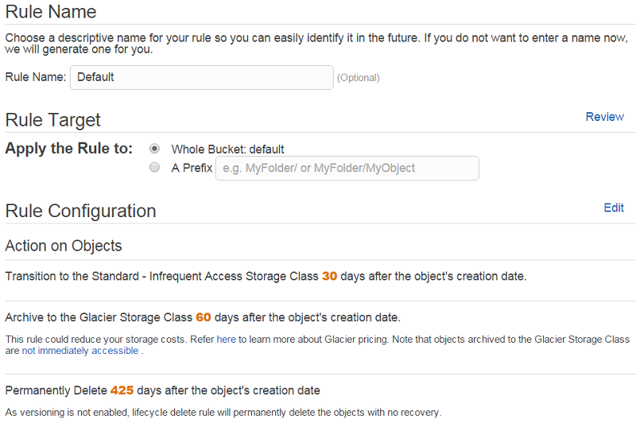

.. Copyright 2010-2018 Amazon.com, Inc. or its affiliates. All Rights Reserved.

   This work is licensed under a Creative Commons Attribution-NonCommercial-ShareAlike 4.0
   International License (the "License"). You may not use this file except in compliance with the
   License. A copy of the License is located at http://creativecommons.org/licenses/by-nc-sa/4.0/.

   This file is distributed on an "AS IS" BASIS, WITHOUT WARRANTIES OR CONDITIONS OF ANY KIND,
   either express or implied. See the License for the specific language governing permissions and
   limitations under the License.

.. _aws-ruby-sdk-s3-example-create-policy-template:

###################################################################
Creating a LifeCycle Rule Configuration Template for an |S3| Bucket
###################################################################

.. meta::
    :description:
        Create an Amazon S3 bucket lifecycle rule configuration template using this AWS SDK for Ruby code
        example.
    :keywords: AWS SDK for Ruby code examples, Amazon S3

If you have (or plan to create) a non-trivial number of objects and want to specify when to move
them to long-term storage or delete them, you can save a lot of time by creating a template for the
lifecycle rules and applying that template to all of your |S3| buckets.

The process includes these steps:

1. Manually modify the lifecycle settings on an existing bucket.

2. Save the rules.

3. Apply the rules to your other buckets.

Start with the following rule:

Run the following code to produce a JSON representation of that rule. Save the output as
:file:`default.json`.

.. code-block:: ruby

    require 'aws-sdk'

    s3 = Aws::S3::Client.new(region: 'us-west-2')
    resp = s3.get_bucket_lifecycle_configuration(bucket: 'default')

    resp.rules.each do |rule|
      rule.to_hash.to_json
    end

The output should look like the following.

.. code-block:: json

    [{"expiration":{"date":null,"days":425},"id":"default","prefix":"","status":"Enabled","transitions":[{"date":null,"days":30,"storage_class":"STANDARD_IA"},{"date":null,"days":60,"storage_class":"GLACIER"}],"noncurrent_version_transitions":[],"noncurrent_version_expiration":null}]

Now that you have the JSON for a lifecycle rule, you can apply it to any other bucket using the
following example. The example takes the rule from :file:`default.json` and applies it to the bucket
:code-ruby:`other_bucket`.

.. code-block:: ruby

    require 'aws-sdk'
    require 'json'

    class Aws::S3::Types::LifecycleExpiration
      def to_map
        map = Hash.new
        self.members.each { |m| map[m] = self[m] }
        map
      end

      def to_json(*a)
        to_map.to_json(*a)
      end
    end

    class Aws::S3::Types::Transition
      def to_map
        map = Hash.new
        self.members.each { |m| map[m] = self[m] }
        map
      end

      def to_json(*a)
        to_map.to_json(*a)
      end
    end

    class Aws::S3::Types::LifecycleRule
      def to_map
        map = Hash.new
        self.members.each { |m| map[m] = self[m] }
        map
      end

      def to_json(*a)
        to_map.to_json(*a)
      end
    end

    # Pull in contents as a string
    value = File.open('default.json', "rb").read
    json_data = JSON.parse(value, opts={symbolize_names: true})

    s3 = Aws::S3::Client.new(region: 'us-west-2')
    s3.put_bucket_lifecycle_configuration(:bucket => 'other_bucket', :lifecycle_configuration => {:rules => json_data})

.. include:: common/s3-note-incomplete-upload-policy.txt
